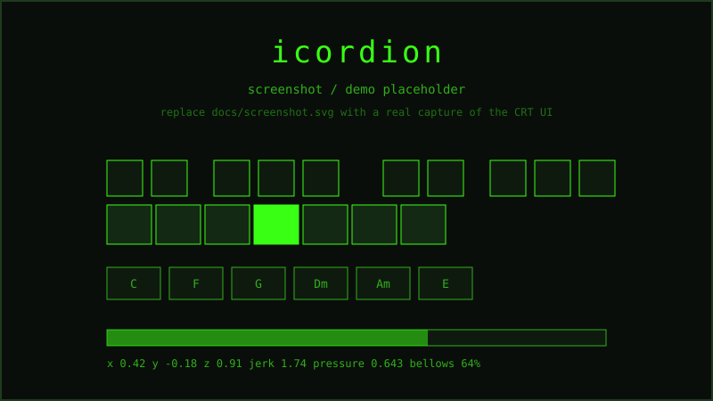

# icordion

[](https://github.com/tejasnaladala/icordion/actions/workflows/ci.yml)

Turn your iPhone into a virtual accordion. Tilt and shake the phone to work the bellows, tap the screen to play notes. The accelerometer is the bellows: hold the phone still and it goes silent, move it and the sound swells and brightens.

Inspired by my best friend's mac-cordian.

## Demo

<!-- Drop a short screen recording or GIF here once captured. Suggested: boot screen, then a clip of the phone tilting while keys are tapped, with audio. -->



> _The image above is a placeholder mockup. Replace `docs/screenshot.svg` with a real screenshot of the CRT-terminal UI, and add a 10-second clip of the phone playing above it._

## Why it's interesting

iOS gates the accelerometer behind two things: an HTTPS origin and an explicit motion-permission tap. So a hobby music toy ends up needing a real local HTTPS server with a cert that covers your LAN IP, plus the `DeviceMotionEvent.requestPermission()` dance. Once that's solved, the phone's raw motion drives a Web Audio synth in real time with no perceptible lag, and you can actually play it like an instrument.

## How it works

**Bellows from motion.** `bellows.js` reads `devicemotion`, takes the gravity-subtracted acceleration, and computes jerk (frame-to-frame change in acceleration magnitude). A 0.4 dead zone throws away sensor noise so a still phone reads exactly zero. Jerk maps to a 0..1 pressure value with a fast attack and a slower release, and a decay loop on `requestAnimationFrame` bleeds pressure back to zero when you stop moving. That's what makes it feel like a bellows instead of an on/off switch.

**Sound from pressure.** `audio-engine.js` synthesizes each note as three oscillators tuned a few cents apart (musette tuning, the wet detuned sound of a French accordion: ±6 cents on the treble reeds, ±3 on the bass). Each oscillator uses a custom 10-harmonic periodic wave for the reedy timbre. Bellows pressure drives two things at once:

- **Volume**, on a square-root curve so quiet playing still reads.
- **A lowpass filter sweep** from 300 Hz (muffled, nearly closed) up to 7 kHz (bright and open), with the resonance Q climbing alongside it.

The signal chain is `notes -> lowpass filter -> bellows gain -> compressor -> master`. The compressor keeps stacked chords from clipping.

**The keyboard.** Two octaves of chromatic treble keys (MIDI 60-83, C4 to B5, 24 notes laid out as natural and sharp rows) plus six bass/chord buttons: C, F, G, Dm, Am, E. Touch handling tracks each finger by `touch.identifier` and uses `elementFromPoint` so you can glide across keys mid-press. There's a mouse fallback so the UI is playable on a laptop too.

## Setup

You need Node.js 18+ and an iPhone on the same Wi-Fi as your computer.

```bash
git clone https://github.com/tejasnaladala/icordion.git
cd icordion
npm install
npm start
```

On first run the server generates a self-signed cert (it shells out to `openssl`) and prints both URLs:

```
  > icordion running
  > http://localhost:3000
  > http://192.168.1.42:3000
  > https://localhost:3443
  > https://192.168.1.42:3443  <-- use this on iphone
```

Two servers run side by side. HTTP on 3000 always works for the UI. HTTPS on 3443 is the one iOS needs for accelerometer access.

## Playing

1. On the iPhone, open the **https** LAN URL in Safari (the one on port 3443).
2. You'll get a cert warning. Tap **Advanced**, then **Continue**.
3. Tap the screen to start.
4. Safari asks for motion-sensor access. Tap **Allow**.
5. Tilt and shake while tapping keys. The harder you move, the louder and brighter the tone.

Bass buttons across the bottom play chords. Live accelerometer values (x/y/z, jerk, pressure) show at the bottom of the screen so you can see what the bellows is reading.

To see the UI without a phone, open `http://localhost:3000` on a laptop. Keys are clickable; there's no accelerometer, so it runs at a fixed bellows level.

## Files

```
server.js              express http + https server, generates the ssl cert
public/
  index.html           the ui
  css/style.css        terminal/crt theme
  js/
    audio-engine.js    web audio synthesis, musette tuning, filter sweep
    bellows.js         accelerometer -> bellows pressure mapping
    mobile-app.js      touch handling, key layout, ui wiring
```

## Notes and limitations

- Phone and computer must be on the same Wi-Fi.
- Cert generation needs `openssl` on your PATH. If it's missing, HTTPS won't start (HTTP still does). On Windows, Git for Windows bundles openssl, or run `choco install openssl`.
- iOS requires HTTPS for accelerometer access, which is the only reason the cert exists.
- Runs on any machine with Node (mac, Windows, Linux).
- Tested on iPhone/Safari. Android may work but its motion API behaves differently.

## License

MIT. See [LICENSE](LICENSE).
